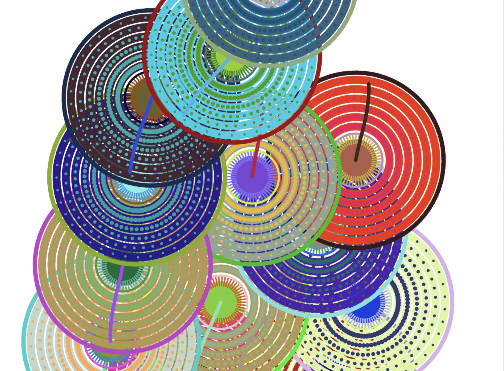
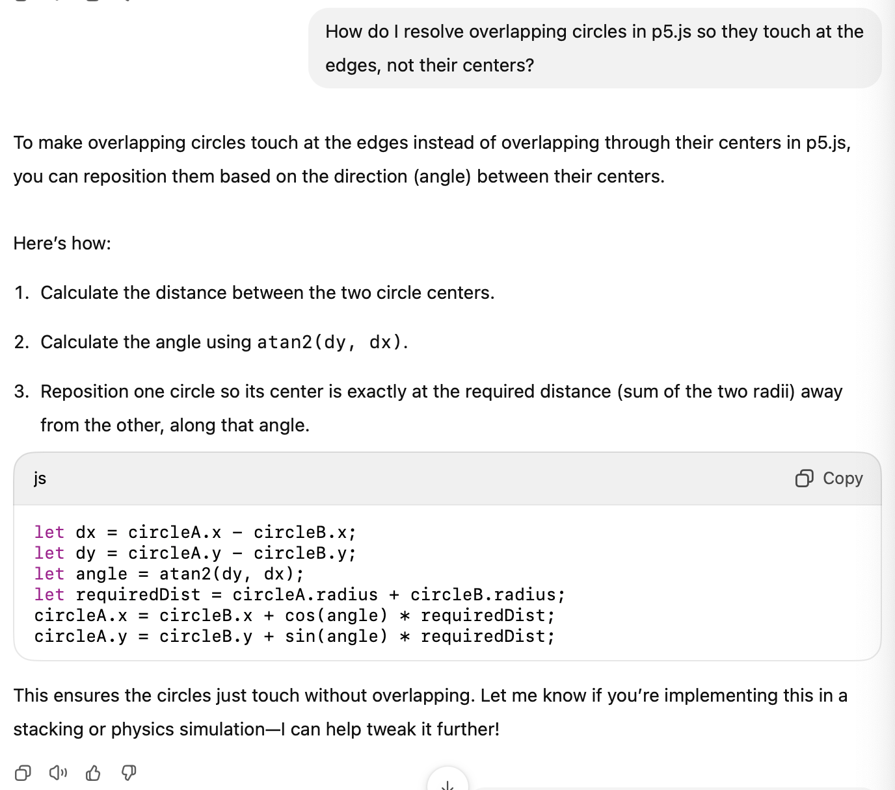

# tut1_groupA_katherineha_userInput
The individual creative coding submission of Katherine Ha (miha0405)

# 🎮 Stacking Wheel Game
## 1. How to Interact With the Work

1. Open the sketch in your browser.
2. Hover your mouse over the wheels to explore and interact with each wheel.
3. Press **ENTER** to activate shaking animation.
4. Click on a random wheel to start the broke and fall-down sequence.
5. After the screen turns white, the stacking game begins!!!
6. Use **← / → arrow keys** to move the falling wheel left and right as you want.
7. Try to stack wheels accurately. The game ends when the stack reaches the top.
8. Press **SPACE** to play again. Reload the page to reset fully.

---

## 2. My Individual part:

### • Interaction method:
I chose **User Input** to drive my individual animation.

### • What I Animated and How:
- **Rotation**: Wheels continuously rotate using angle + speed (this is for the group part)
- **Position**: Falling wheels use velocity and gravity simulation.
- **Collision/Stacking**: When wheels land on others, they reposition using trigonometry to align by circumference. (with the help of ChatGPT)
- **State Control**: I used custom `state` logic to transition from idle to game mode.

---

## 3. Visual & Creative Inspiration

- The original wheel design came from our group code.
- The stacking logic was inspired by **Tetris game**.
- UI elements (welcome + game over screens) were styled using **monospace font** and soft pastel-inspired color palette (`#999B84`, `#EFD9D1`).

---

## 4. Technical Breakdown

### Key Features:
- Created 5 game states: `idle`, `shaking`, `fallingPhase1`, `fallingPhase2`, and `gameStart`.
- Built a collision system to detect and reposition overlapping circles on contact.
- Controlled movement with real-time key input (`←` and `→`).
- Used `atan2()`, `cos()`, and `sin()` to calculate wheel spacing during stacking.

### My Custom Functions / Changes:
- `hitsStackEdge()` – handles collision detection and correction between falling wheel and the stacked ones.
- `Wheel.prototype.update()` – updated to include hover scaling, position smoothing, and interaction-based behavior.
- All game text boxes are styled using `rect()` and `textFont('monospace')`.

---

## 5. Tools and Techniques From Outside the Course

### Trigonometric Repositioning (via ChatGPT):
I needed help solving the overlap issue when wheels stacked.
<p align="center">
  
</p>
I asked ChatGPT how to resolve overlapping circles based on their angle and distance. It helped me use this logic:

```js
let angle = atan2(dy, dx);
w.x = sw.x + cos(angle) * requiredDist;
w.y = sw.y + sin(angle) * requiredDist;
```
<p align="center">
  
</p>
